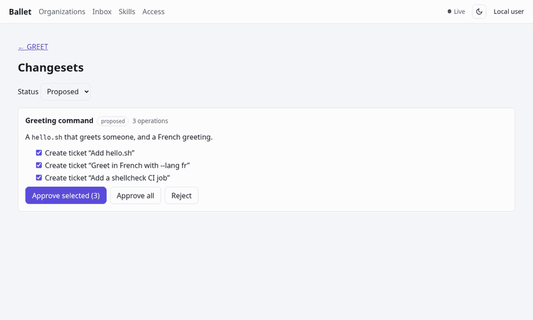
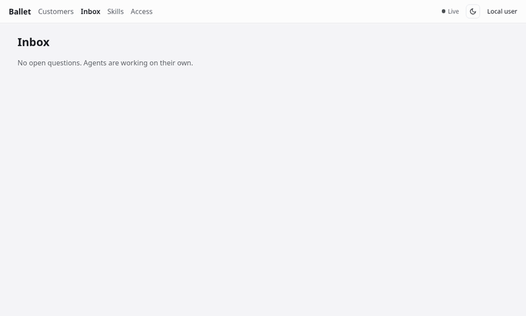
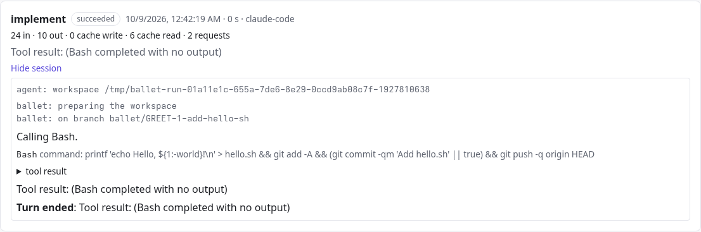
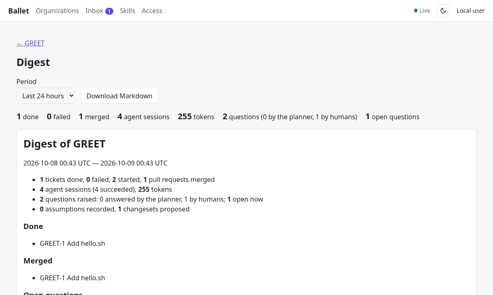
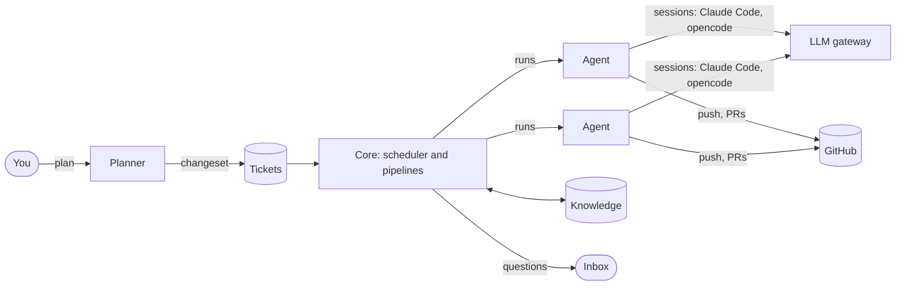

<div align="center">


# Ballet

**Plan in the evening. Merge in the morning.**

Ballet runs AI coding agents through the process a good team follows.<br>
You plan with a planner agent and approve the plan; separate agent sessions implement,<br>
review, verify and merge it ticket by ticket while you sleep. You are asked only what agents can't decide safely.

[](https://github.com/denyszorinets/ballet/actions/workflows/ci.yml)
[](https://denyszorinets.github.io/ballet/)
[](https://denyszorinets.github.io/ballet/docs/getting-started/quickstart.html)

[Website](https://denyszorinets.github.io/ballet/) ·
[Quickstart](https://denyszorinets.github.io/ballet/docs/getting-started/quickstart.html) ·
[User guide](https://denyszorinets.github.io/ballet/docs/user-guide/index.html) ·
[How it compares](https://denyszorinets.github.io/ballet/docs/concepts/comparison.html)

</div>

---

### Approve a plan, watch it run

The planner proposes tickets as a changeset; nothing changes until you approve it. Ready tickets then
run through the pipeline (**implement → review → verify → integrate**), each stage a separate agent
session, until the pull request is merged.

<p align="center"></p>

### Answer questions without babysitting

Agents ask only what's risky. Answer within minutes and the answer goes **into the running session**;
answer in the morning and the parked session resumes where it stopped. Other tickets keep going.

<p align="center"></p>

<sub>Recorded from a real Ballet with its built-in fake model (no API key), which runs the tool call a
ticket scripts instead of writing code. Re-record with <code>make media</code>.</sub>

## Why Ballet

| | |
|---|---|
| 🗺️ **Plans, not prompts** | A planner agent turns a conversation into epics and tickets with acceptance criteria and dependencies. You approve them; Ballet runs them in dependency order, in parallel. |
| 🔍 **No agent grades its own work** | Implement, review, verify and integrate are separate sessions in fresh workspaces. They share reports, never transcripts. |
| 💬 **Questions, answered live or later** | One inbox for every project. The planner answers from the knowledge base when it can; your answers go into the running session or resume it later. |
| 📚 **Knowledge that grows** | Docs, decisions and debt are written back on every ticket; every answer becomes a recorded decision. |
| 🧩 **Your agents, your infrastructure** | Self-hosted. Claude Code or opencode per stage, on agents built from each project's devcontainer: a laptop, VMs or N containers on Kubernetes. |
| 🛑 **Safe to leave alone** | Token budgets enforced at Ballet's LLM gateway, pause and kill switches, retries, durable state and a morning digest. |
| 🏢 **Many organizations, one platform** | Each organization is isolated: its code, knowledge, keys and budgets. OIDC sign-in with role bindings; platform admins run the installation. |

<table>
<tr>
<td width="50%"><p align="center"><sub>Every session's live transcript; message or interrupt it while it runs.</sub></p></td>
<td width="50%"><p align="center"><sub>The morning digest: done, merged, waiting, and what it cost.</sub></p></td>
</tr>
</table>

## Quickstart

Ten minutes, no API key: Ballet on your machine with a fake model and a demo repository.

```bash
npm install -g @anthropic-ai/claude-code   # the agent runtime sessions run
git clone https://github.com/denyszorinets/ballet.git && cd ballet
BALLET_FAKE_LLM=1 make run                 # needs Go 1.27 and Bun; then open http://localhost:8080
```

Then follow the [quickstart](docs/getting-started/quickstart.rst) to create a project, approve a plan and
watch the agents. For a real project, see [Your first real project](docs/getting-started/real-project.rst);
to install with containers, see [Install Ballet on one host](docs/how-to/install-single-host.rst).

## How it fits together



**Core** holds the tracker, planner, scheduler and pipelines, and serves the web UI. **Agents** run in
containers or VMs built from each project's devcontainer and run sessions as processes. The **LLM gateway**
adds your keys and meters every token; **Knowledge** keeps each organization's docs and decisions. See the
[architecture overview](docs/architecture/overview.rst) and the
[decisions](docs/architecture/decisions/index.rst) behind it.

## How it compares

Hosted agents (Devin, Copilot coding agent, Codex) run one agent per issue in a vendor's cloud. Session
managers (Conductor, Claude Squad, Vibe Kanban) run many agents on your laptop, under your eye. Ballet runs
a team's process (plan, separate review and verification, questions, knowledge) on your servers, unattended.
[Full comparison →](docs/concepts/comparison.rst)

Ballet is young. Its first version targets one unattended night of work on a real project.

## Documentation

The [website](https://denyszorinets.github.io/ballet/) and [documentation](https://denyszorinets.github.io/ballet/docs/)
are published from `develop`. The docs are a Sphinx site under [`docs/`](docs/index.rst):
[getting started](docs/getting-started/index.rst), [user guide](docs/user-guide/index.rst),
[concepts](docs/concepts/index.rst), [how-to](docs/how-to/index.rst), [reference](docs/reference/index.rst) and
[architecture](docs/architecture/index.rst).

```bash
make docs           # build into docs/_build/html
make docs-serve     # live preview on http://127.0.0.1:8000
make docs-check     # strict build + link check
make site           # landing page + docs, as published, into _site/
make media          # re-record the README's GIFs and the docs screenshots
```

## Development

Go (backend services) and Svelte (web UI). `make run` builds the web UI into Core, builds every service and
runs them; `BALLET_AUTH=oidc make run` adds multi-user sign-in through a development Keycloak (`alice` /
`alice`; needs Java 21+). See [Run Ballet locally](docs/how-to/run-locally.rst). Run `make help` for all
development targets.

Work is tracked in GitHub issues and follows GitFlow: feature branches from `develop`, pull requests into
`develop`, releases on `main`.
